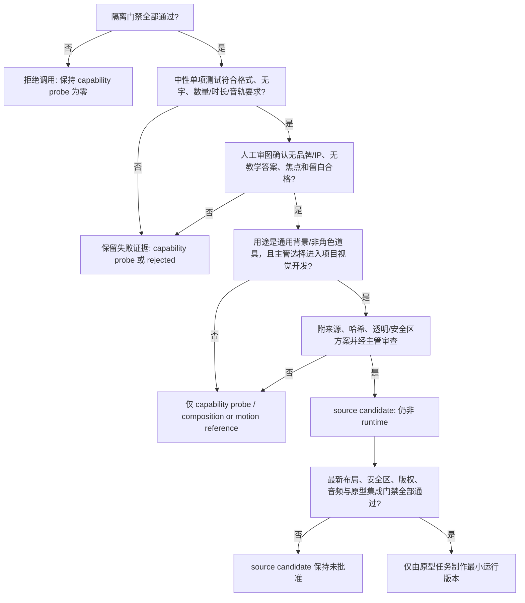

# Grok 隔离复测与用途矩阵

状态：`planning_only / shared_host_calls_closed / runtimeApproval=false`。

日期：2026-07-11。本文件不授权当前 Administrator 宿主调用 Grok，不要求登录，不生成任何图片、视频或声音，也不影响原型任务正在进行的 M08 工作。

## 一句话结论

Grok 已被证明能生成图片、接受一张 Grok 自己生成的参考图、并生成图生视频；它适合未来在**真正隔离环境**里探索通用构图和失败风险。它目前不适合交付星龙工坊的正式素材，更不能处理课程、角色、代码、声音或运行集成。

## 已有实测事实

| 项目 | 已证实的事实 | 仍然不能证明 |
| --- | --- | --- |
| 模型 | 有限探测的会话记录为 `grok-4.5`，指纹 `fp_a39489019fa99b6e` | 未来版本、价格、配额或长期稳定性 |
| 文生图 | 生成过 1280x720 空场景和两张 1024x1024 图 | 项目视觉方向、透明素材或角色质量合格 |
| Grok 自有参考图 | 接受过一张先前 Grok 种子图，并产出三阶段种子图 | 项目角色参考图可安全上传，或状态能做成可用分层 |
| 图生视频 | 生成过可解码的 544x544 H.264 MP4 | 2-4 秒、无声、透明、首尾明确或可运行 |
| 透明/无字 | 道具测试交付 JPG、无 alpha，并烘焙 `O2`、`Grow` 等文字 | 透明 PNG 和严格无字要求可稳定满足 |
| 声音 | 视频源有意外 AAC 音轨，即使接近静音 | 可作为 Foley、语音、奖励音或教学混音 |
| 项目风格与角色 | 空场景不符合已选精细星空/矢量桥方向；三阶段种子只有大体一致 | 最终星芽、咚咚或项目成熟美术可交付 |
| 主机边界 | 当前 Administrator 宿主自动注入/读取指令、skills 和 MCP；两次还读取 `imagine` skill | 即使空目录也不等于隔离 |

当前总状态：`contradicted_local_instruction_read / no_project_file_observed / no_further_shared_host_calls`。这表示没有观察到项目文件或录音泄漏，但共享宿主仍**不得再调用**。

## Grok 能做什么，不能做什么

| 类别 | 未来隔离复测后的位置 | 例子 | 边界 |
| --- | --- | --- | --- |
| 可优先复测 | 通用场景缩略图 | 空星球、花园、桥的构图和留白 | 无角色、无文字、无项目界面；只作粗概念 |
| 可优先复测 | 非角色道具轮廓/构图探索 | 中性头盔、桥垫、阀门、种子容器 | 先验数量、无字、alpha；不进入运行 |
| 可优先复测 | 同一非角色对象状态变化 | 闭合种子 -> 倾听 -> 第一片叶 | 只验证一致性，不等于可拆分角色层 |
| 可优先复测 | 短动作节奏参考 | 中性种子开叶、无声 2-4 秒 | 只能作动作参考，不能遮住教学层 |
| 可优先复测 | prompt 草案/失败风险自检 | 列出数量、嵌字、留白、教学答案泄漏风险 | 只是草案，必须由人复核 |
| 只可辅助 | 分镜候选 | 把一个故事结果拆成起/中/终关键帧 | 不决定课程因果或最终镜头 |
| 只可辅助 | 色彩、材质、镜头运动方向 | 比较扁平、纸感、柔光等方向 | 不替代用户审美选择和版权判断 |
| 不得交给 Grok | 课程与关卡 | 音符顺序、掌握规则、错误修复、章节门槛 | 由课程合同、教师和原型决定 |
| 不得交给 Grok | 精确教学绘制 | 五线谱、音符、琴键、唱名、答案标签 | 必须由代码原生绘制 |
| 不得交给 Grok | 最终星芽/咚咚 | 最终身份、三头芽、尾套、咚咚角数与动作 | 需要确定性角色管线和逐帧人工审查 |
| 不得交给 Grok | 版权结论或竞品审查 | 相似性、权利范围、发布地区结论 | 需要来源台账和独立专业复核 |
| 不得交给 Grok | 代码或截图审查 | `app.js`、UI、运行截图、M08 页面 | 当前任务范围禁止；自动工具不能替代运行审查 |
| 不得交给 Grok | 儿童/成人声音 | 录音、TTS、声音克隆、音频上传 | 录音门禁关闭；克隆未经授权 |
| 不得交给 Grok | 运行集成 | `assets/runtime`、播放、混音或教学遮挡处理 | 由原型唯一运行写者和主管另行放行 |

## 现有工具如何分工

以下建议只使用项目已有证据，不把工具名称当成能力保证。

| 工具或路线 | 已有证据 | 最适合做什么 | 目前不该宣称什么 |
| --- | --- | --- | --- |
| Grok 官方 CLI | 文生图、Grok 自有参考图、图生视频均实际成功；交付规格和共享宿主边界失败 | 隔离后做中性概念、构图/计数/状态一致性和动作节奏探测 | 不能做正式项目角色、透明成品、无字保证或运行素材 |
| 内部 OpenAI 生图 | 本媒体支线尚无同等项目探测证据 | 仅可在单独授权和同等审查下考虑通用视觉开发 | 不因平台名称自动视作已通过 |
| Gemini | MCP 已实测无视频工具；网页方式曾实际生成两条 MP4，但角色/装备一致性被拒绝 | 参考视觉开发、分镜/关键帧讨论；网页视频仅在单独授权下做动作参考 | 不可称 MCP 已支持视频，也不可交付项目角色成片 |
| 未来 Sora | 本项目没有实际 Sora 成片或账号/权限证据 | 只有在另行授权并通过角色、时长、音轨和安全区审计后，才测试中性动作 | 不预设可用、可控或可运行 |
| Rive/Spine | 已规划为确定性角色动作路线，尚无本项目成品 | 星芽头盔、尾套、背包和咚咚低姿动作的可控状态机 | 不可声称当前已有动画资产 |
| 代码原生 SVG/Canvas | 原型负责精确运行绘制与坐标合同 | 五线谱、琴键、教学 UI、保护区裁切和减少动态终态 | 不替代高质量角色动画本身 |
| 确定性 DSP | 现有 7 项原创 SFX 已有格式、哈希和并播审查 | Foley、正确/再试、环境与奖励短动机的可追溯制作 | 不能替代真机听审、角色语音或儿童观察 |
| 真人固定台词 | 仅有录制规划；尚未收到真实录音或授权 | 录音门禁通过后录固定短句、轻度处理 | 不能训练或使用儿童声音克隆 |

## 隔离环境先决门禁

未来只能选择以下一种环境：一个新建、未同步资料的 Windows 本地标准用户，或一台独立 VM。不要在当前 Administrator 会话、当前浏览器资料、当前项目目录或当前 Grok 会话中继续试。

在登录、发 prompt 或上传任何东西之前，必须全部通过：

1. 独立环境中运行官方二进制的只读检查，证明 `0 inherited instructions`、`0 skills`、`0 MCP`。
2. 检查记录显示 `0 unrelated local reads`；不能读取 Administrator 的 `Claude.md`、`imagine` skill、浏览器资料或其他本机工具配置。
3. 在该新用户/VM 的用户目录创建一个专用空目录；尚未复制项目、角色图、截图、声音或课程文档。
4. 输出目录、会话记录、模型/版本、登录方式和网络时间均可追溯；不把 token、设备码、OAuth URL 或密码写入项目或聊天。
5. 只有前四项通过后才由用户在新环境本地完成登录。登录前失败，或首次调用出现任何继承/读取，即刻停止，不“换参数重试”。

隔离检查未通过时的结论固定为：`shared_host_or_unverified_environment_rejected`。这不是“再试一次”的提示。

## 最多六个中性复测

所有测试在隔离门禁通过后才可运行；每项最多一次，失败不自动重试。输入不包含星龙工坊 IP、角色、课程、截图、代码、录音或项目文件。

| ID | 中性输入 | 要证明什么 | 期待交付 | 自动与人工检查 | 立即停止条件 |
| --- | --- | --- | --- | --- | --- |
| `IR-IMG-01` | 纯文字 16:9 空的双星球与桥 | 宽画幅、留白、无字 | 1 张 PNG/JPG | 尺寸、OCR/人工文字检查、下方留白比例 | 文字、UI、角色、品牌、错误画幅 |
| `IR-IMG-02` | 纯文字 6 件通用施工道具表 | 精确数量、无字、透明边界 | 1 张 PNG，声明 alpha | 文件格式/alpha、6 件人工计数、OCR | 不是 PNG、无 alpha、数量错、嵌字或融合 |
| `IR-IMG-03` | Grok 在隔离环境自己生成的中性物体作为唯一参考 | 同一非角色对象的三阶段一致性 | 1 张三阶段图或 3 张独立图 | 参考输入日志、轮廓/颜色人工比对、无字 | 读取其他文件、参考未接受、状态不清 |
| `IR-VID-01` | 该中性物体，明确闭合起始和第一状态终止 | 真正 2-4 秒无声动作、首尾状态 | 1 条 MP4/WebM | `ffprobe` 时长/帧率/音轨、首中尾帧、人工动作检查 | 非视频、少于 2/多于 4 秒、有音轨、首尾错误、全屏 UI/文字 |
| `IR-TEXT-01` | 不含项目内容的通用媒体 brief | prompt 草案是否会自列数量/文字/安全区风险 | 1 个纯文本回答 | 保存净化后 prompt/回答；人检查不越权下结论 | 读取文件、搜索、把草案说成裁决 |
| `IR-FMT-01`（可选） | 单个无角色透明道具 | 格式、alpha、透明边缘和可下载性 | 1 个带 alpha 文件 | alpha 阈值、边缘像素、哈希、下载路径 | 透明失败、假透明、嵌字或非预期文件 |

视频若带自动音轨：保留原件为 source provenance，导出静音审核衍生品；原音不得进入任何音效、语音或运行混音目录。视频若无法严格做到 2-4 秒，直接记 `prompt_compliance_rejected`，不以裁切、推拉或淡化冒充生成视频。

## 每次复测的证据包

每项测试无论成功或失败，都应保存：

- 原始下载和只读审核副本；不覆盖原件。
- 已净化的完整 prompt 与回答：仅保留用户输入、助手最终回答和媒体路径；绝不复制系统提示、skills、MCP、token 或推理。
- 官方二进制版本、会话可见模型/指纹、调用时间、可见成本/用量（没有就写 `not returned`）。
- 图片的文件格式、像素尺寸、alpha 存在性、SHA-256；视频还需 `ffprobe` 的编码、时长、帧率、分辨率和音轨。
- 接触表；视频的开始/中间/结束帧；人工审图结论。
- 运行引用扫描为 `0`，以及每项的 `passed`、`partial`、`missing`、`contradicted` 或 `rejected` 状态。

## 何时可进入项目候选：裁决树



以下情况为永久拒绝，不能因“生成得好看”而降级处理：共享/未验证宿主读取、项目课程/代码/截图/录音输入、精确谱表或琴键、最终星芽/咚咚角色交付、儿童/成人声音、声音克隆、版权结论、竞品审查，以及任何直接运行集成。

## 本轮记录

- 新增 Grok 调用：`0`。
- 新增媒体：`0`。
- 接触录音：`0`。
- 修改运行代码或 runtime 资产：`0`。
- 对当前 active M08 的影响：`0`；原型任务继续独立完成其工作。

## 2026-07-12 隔离环境预检

状态：`blocked_waiting_isolated_environment`。

本轮只读检查发现：当前身份仍为 `Administrator`；未发现先前建议的 `grok-media-probe` 本地标准用户或其用户目录；本机没有可用的 Hyper-V VM 命令。这个结果不枚举其他用户资料，也不能把“可能有另一个账户”当作已通过的隔离环境。

因此：

- 实际 Grok 调用次数：`0`。
- 媒体、参考图、登录、凭证和项目文件输入次数：`0`。
- 当前共享宿主的 `no_further_shared_host_calls` 不变。
- 下面的基准包只是一份离线执行说明；只有用户明确准备独立 Windows 用户或 VM，并在其中证明所有隔离门禁后，才能申请执行。

## 隔离复测通用执行约束

每一项测试都要先写入一次性的审计单，记录测试 ID、操作者、隔离环境标识、空目录路径、模型/版本、开始时间和最大调用次数。共同约束如下：

```text
Use only the official native Grok CLI in the approved isolated empty directory.
Do not read any local file unless this test names one internally generated neutral reference.
Do not use web search, MCP servers, subagents, memory, browser profiles, project files,
character references, screenshots, code, recordings, documents, brands, or copyrighted characters.
Make exactly one request for this test. Do not retry after a failure.
Return only the saved output path and the requested technical facts.
```

安全停止条件优先于所有质量评分：只要会话显示任何 inherited instruction、skill、MCP、无关本地读取、项目文件、浏览器资料、凭证暴露或未批准网络工具，立即停止整个包，保留日志摘要并标记 `contradicted_isolation`。图片/视频质量失败则停止该项，不重试；只有不依赖该输出的后续中性项可在主管确认后继续。

## 六项中性基准测试包

总上限是六次调用：四次媒体、一次文字、一次可选格式验证。任何一项都不得使用星龙工坊名称、角色、课程、场景图、谱表、琴键、代码或录音。

### IR-IMG-01: 16:9 空场景构图

调用上限：1 次文生图。

```text
Generate exactly one original 16:9 flat 2D environment thumbnail: two small distant generic astronomical worlds connected by one simple bridge of light. No characters, people, animals, UI, words, letters, numerals, logos, maps, music symbols, staff lines, piano keys, brands, or copyrighted imagery. Keep the lower 38 percent and the center 28 percent calm and mostly empty for later code overlays. Use crisp, simple shapes and a clear horizon. Do not embed text.
```

- 自动检查：文件可解码；宽高比为 16:9；记录格式、像素、SHA-256。
- 人工检查：无字、无 UI、无角色；桥不占下方 38%；不是现有商业作品的可识别仿制。
- 通过标准：只证明宽幅构图和留白的 `capability_probe`，不是项目背景候选。
- 停止条件：错误画幅、任何文字/UI/品牌/角色，或隔离异常。

### IR-IMG-02: 精确数量与 alpha 道具表

调用上限：1 次文生图。

```text
Generate exactly one original PNG with a transparent background. Show exactly six separate, fully visible, generic construction objects: a round floor plate, a square support pad, a small unmarked valve, a plain sealed helmet, a compact unmarked backpack, and a plain seed capsule. Arrange them with generous gaps. No characters, faces, hands, UI, words, letters, numerals, labels, logos, music symbols, staff lines, piano keys, brands, or copyrighted imagery. Do not add a white or colored backdrop. Return the path, pixel dimensions, file format, and whether alpha is present.
```

- 自动检查：PNG 签名、RGBA/alpha 存在、alpha 边界像素、SHA-256。
- 人工检查：恰好六件，不重复、不融合、不裁切；无嵌字；透明边缘干净。
- 通过标准：仅证明数量/透明交付能力；不证明项目道具设计可用。
- 停止条件：非 PNG、无 alpha、数量不为六、文字/标签、品牌、隔离异常。

### IR-IMG-03: 同一中性对象三阶段

前置条件：`IR-IMG-02` 通过且其中的无字种子容器可作为**唯一**内部中性参考。若前置不通过，直接标 `missing_dependency`，不新增调用。

调用上限：1 次参考图派生。

```text
Use only the named neutral seed-capsule PNG generated inside this isolated test package as the visual reference. Generate one plain-background image with three evenly spaced states of the same object: closed, listening with one small neutral glow, and first leaf open. Preserve the same silhouette, proportions, colors, and material across all three states. No characters, UI, words, letters, numerals, labels, logos, music symbols, staff lines, piano keys, brands, or copyrighted imagery.
```

- 自动检查：参考输入路径在本包内；输出尺寸、格式、alpha、SHA-256 已记录。
- 人工检查：轮廓、配色、材质一致；三阶段可区分；无嵌字。
- 通过标准：`consistency_capability_probe`，不能代替可拆分状态层。
- 停止条件：读取任何其他文件、参考未被接受、状态不可区分、隔离异常。

### IR-VID-01: 2-4 秒无声首尾明确动作

前置条件：`IR-IMG-03` 通过。否则标 `missing_dependency`，不新增调用。

调用上限：1 次图生视频。

```text
Use only the named neutral three-stage object reference generated inside this isolated test package. Generate exactly one 2 to 4 second silent 2D video. Start with the object fully closed. End with exactly the first leaf open, with no second leaf. Keep a fixed camera and a plain background. No audio, no characters, UI, words, letters, numerals, labels, logos, music symbols, staff lines, piano keys, brands, or copyrighted imagery. Return the path, format, dimensions, frame rate, duration, and whether an audio stream exists.
```

- 自动检查：完整解码；`ffprobe` 记录编码、分辨率、帧率、时长、音轨；开始/中间/结束抽帧和 SHA-256。
- 人工检查：首帧完全闭合，末帧恰为第一片叶；无第二片叶、无文字和无全屏 UI；动作连续。
- 通过标准：仅 `motion_capability_probe`；不证明教学安全区、透明分层或运行适配。
- 停止条件：时长不在 2-4 秒、存在音轨、首尾状态错误、非视频、隔离异常。

### IR-TEXT-01: prompt 失败风险自检

调用上限：1 次纯文本调用。

```text
Without reading files or using tools, draft exactly three generic visual-media prompts: an empty 16:9 bridge environment, a six-object transparent prop sheet, and a 2-to-4-second silent object-motion clip. For each, list required count or duration, forbidden text/UI/music-answer cues, required empty overlay space, and likely failure risks. Do not make a quality, curriculum, copyright, child-safety, or release decision. Do not generate media.
```

- 自动检查：仅纯文本；保存经过净化的完整 prompt 与最终回答；无工具事件。
- 人工检查：确实列出数量、无字、alpha/音轨、留白风险；不越权下课程、版权或发布结论。
- 通过标准：`draft_aid_only`。
- 停止条件：工具调用、文件读取、网页搜索、把草案写成裁决、隔离异常。

### IR-FMT-01: 可选透明交付复核

调用上限：1 次文生图；仅在前五项都无安全/隔离异常后执行。

```text
Generate exactly one original transparent PNG of one plain, unmarked, non-character seed capsule. Keep all visible pixels at least 24 pixels inside the canvas edges. No background, shadow, text, letters, numerals, UI, labels, logos, music symbols, staff lines, piano keys, brands, or copyrighted imagery. Return the path, pixel dimensions, file format, and alpha availability.
```

- 自动检查：PNG、RGBA、边缘 24px 内 alpha 阈值、文件哈希。
- 人工检查：只有一个完整物体、没有白底假透明、无嵌字。
- 通过标准：仅为格式能力证据。
- 停止条件：透明失败、边缘越界、嵌字、隔离异常。

## 统一评分表

先做安全与边界判定；它不是可加分项目。

| 项目 | 0 分 | 1 分 | 2 分 |
| --- | --- | --- | --- |
| 隔离/本地读取 | 任何继承或无关读取，整个包停止 | 不适用 | 0 inherited instructions/skills/MCP/无关读取，有日志证据 |
| 格式与元数据 | 无法解码或缺记录 | 可解码但规格不符 | 格式、尺寸、alpha/音轨、哈希全部符合 |
| 提示词约束 | 出现文字、数量错、品牌或 UI | 小瑕疵但不影响能力判断 | 全部负面约束遵守 |
| 视觉/动作 | 主体不清或状态错误 | 基本可见但有漂移/留白问题 | 清楚、可审、满足首尾/数量/留白 |
| 可追溯性 | 原件、prompt 或模型信息缺失 | 记录不完整 | 原件、净化 prompt/回答、模型、审计和哈希齐全 |

任何隔离项为 0：`contradicted`，不得继续。任何其他项为 0：该测试 `rejected`；为 1：`partial`；所有非隔离项为 2：最多进入 `capability_probe_passed`，仍不是项目 `source_candidate`。

## 其他可帮忙事项：离线模板

这些模板可以现在由人填写或在未来隔离环境中让 Grok 辅助草拟；任何结果都必须由人审核。

### 三版镜头/素材 prompt 草案

| 草案 | 必填字段 | 不得自行决定 |
| --- | --- | --- |
| 构图版 | 场景类型、画幅、主体数量、留白比例、禁止元素 | 课程目标、角色设定、最终美术方向 |
| 状态版 | 起始状态、中间变化、终态、固定元素、禁止漂移 | 是否算教学完成或掌握 |
| 动作版 | 秒数、固定镜头、首尾状态、音轨要求、抽帧点 | 运行触发时机、音频混音或下一关 |

### 视觉连续性与漂移风险检查模板

```text
资产 ID：
类型：场景 / 道具 / 中性对象 / 动作参考
必须稳定：数量、轮廓、配色、材质、起始状态、终态、留白
必须不存在：文字、UI、答案线索、品牌、角色、音符、谱线、琴键、额外肢体/尖刺
人工判定：passed / partial / rejected
理由与帧号：
```

### 素材 manifest 草案

```json
{
  "id": "IR-XXX-00",
  "classification": "capability_probe",
  "runtimeApproval": false,
  "sourcePromptId": "IR-XXX-00",
  "model": "record actual value",
  "modelFingerprint": "record actual value or not returned",
  "sourcePath": "project-external isolated output only",
  "reviewCopyPath": "concepts/grok-isolated-retest/only-after-review",
  "sha256": "record actual value",
  "image": {"format": "PNG/JPEG", "width": 0, "height": 0, "alpha": false},
  "video": {"format": "MP4/WebM", "durationSeconds": 0, "frameRate": 0, "audioStreams": 0},
  "auditStatus": "passed/partial/missing/contradicted/rejected"
}
```

### 接触表人工评分量表

| 维度 | 通过问题 | 失败例子 |
| --- | --- | --- |
| 数量 | 是否恰好等于要求数量？ | 多出物体、合并物体、漏物体 |
| 无字 | 是否没有文字、数字、标签或 UI？ | `O2`、`Grow`、按钮、答案 |
| 透明/边界 | 是否真有 alpha，且主体不贴边？ | 白底 JPG、假透明、裁切 |
| 一致性 | 不同状态是否仍是同一对象？ | 轮廓、配色、材质突然改变 |
| 动作 | 首尾是否精确满足约束？ | 已经开叶、长出第二片叶、镜头跳变 |
| 教学留白 | 代码层预留的位置是否干净？ | 主体/尾迹占谱表、键盘或中央任务区 |

### 结果应该交给谁

| 需要的下一步 | 优先路线 | Grok 的位置 |
| --- | --- | --- |
| 通用位图视觉开发 | 内部 OpenAI 生图或 Gemini，均需各自实测与审查 | 只提供中性构图/失败风险参考 |
| 生成式视频动作探索 | 未来 Sora 或已授权 Gemini 网页路径，需单独审计 | 仅提供中性动作节奏参考 |
| 最终星芽/咚咚动作 | Rive/Spine 或确定性分层序列帧 | 不交付最终角色 |
| 谱表、琴键、保护区 | 原型的 SVG/Canvas/代码层 | 不参与精确教学绘制 |
| Foley/反馈/环境与奖励音 | 现有确定性 DSP 与人工听审 | 不使用生成视频原音 |
| 星芽/咚咚台词 | 用户授权后的真人固定台词和本地轻处理 | 不读取、合成或克隆声音 |

## 本工作包的采用结论

当前没有任何新结果可进入 `source_candidate`。只有隔离门禁、具体中性测试、来源包和人工审查都通过后，通用背景或非角色道具才可能被主管考虑为 `source_candidate`；这仍不等于 runtime。最终角色、教学绘制、声音、课程、代码、版权和运行集成永远不由 Grok 决定。
